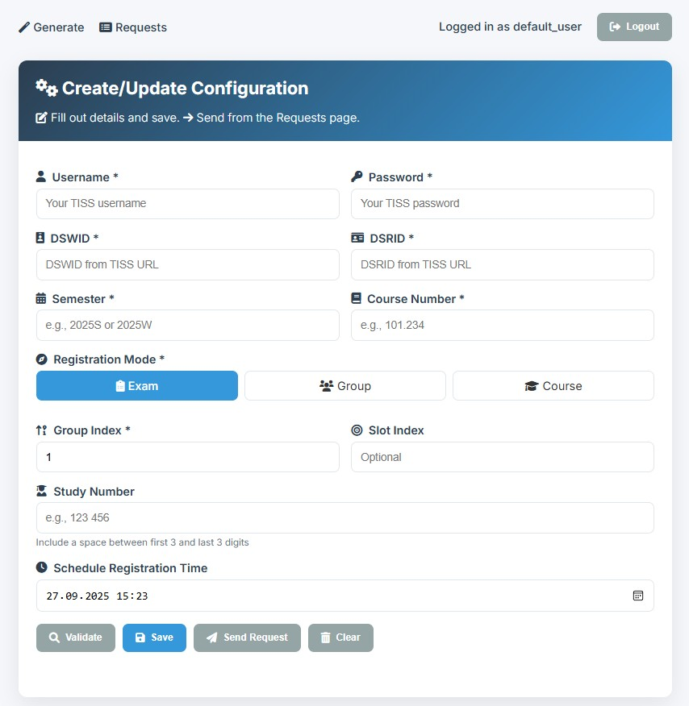

# EduFlow Pro

🎓 **Intelligent Course Registration Automation for TU Wien**

A Python application that automates the registration process for courses and exams on TU Wien's TISS platform using Selenium WebDriver. The application provides both a command-line interface and a modern web-based frontend.

## 🖥️ Website Preview





## ✨ Features

- 🔐 **Automated Login**: Secure authentication with TISS credentials
- 🎯 **Smart Navigation**: Automatically navigates to course/exam pages
- 📋 **Group Selection**: Select specific groups and time slots
- 🔢 **Study Number Support**: Automatic study number selection
- ⚡ **Instant Registration**: Submit registration forms automatically
- ⏰ **Scheduled Execution**: Wait until a specific datetime to register
- 🌐 **Web Interface**: Modern, responsive web frontend
- 📊 **Request Monitoring**: Track and manage registration requests
- 💾 **Configuration Persistence**: Save and load configurations
- 🔄 **Real-time Status**: Live updates on registration progress

## 🏗️ Project Structure

```
EduFlow Pro/
├── src/                          # Source code
│   ├── main.py                   # Main Flask application (no auth - default)
│   ├── main_auth.py              # Flask application (with auth)
│   ├── auth_server.py            # Authentication server
│   ├── tiss_auto_login.py        # Core automation script
│   └── setup.py                  # Setup script
├── app.exe                       # Compiled executable (main.py)
├── templates/                    # HTML templates
│   ├── index.html               # Main application page
│   ├── generate.html            # Configuration page
│   ├── login.html               # Login page
│   └── requests.html            # Requests monitoring page
├── static/                       # Static assets
│   ├── css/                     # Stylesheets
│   │   ├── styles.css           # Main stylesheet
│   │   ├── login.css            # Login page styles
│   │   ├── generate.css         # Configuration page styles
│   │   └── requests.css         # Requests page styles
│   └── js/                      # JavaScript files
│       ├── script.js            # Main JavaScript
│       ├── login.js             # Login functionality
│       ├── generate.js          # Configuration functionality
│       └── requests.js          # Requests functionality
├── docs/                        # Documentation
│   ├── DEVELOPMENT.md           # Development guide
│   ├── tiss_readme.md           # Detailed documentation
│   └── website.jpg              # Website preview image
├── config/                      # Configuration files
│   └── README.md                # Configuration guide
├── examples/                    # Example files
│   ├── cli_config_example.json  # CLI configuration example
│   └── README.md                # Examples documentation
├── requirements.txt             # Python dependencies
├── .gitignore                   # Git ignore rules
├── README.md                    # This file
└── PROJECT_STRUCTURE.md         # Project structure documentation
```

## 🚀 Quick Start

### Prerequisites

- **Python 3.8+**
- **Google Chrome** browser
- **TISS account** with valid credentials

### Installation

1. **Clone the repository:**
   ```bash
   git clone <repository-url>
   cd EduFlow-Pro
   ```

2. **Install dependencies:**
   ```bash
   pip install -r requirements.txt
   ```

3. **Run the application:**
   ```bash
   # Option 1: With authentication
   python src/main.py
   
   # Option 2: Without authentication (simpler)
   python src/main_noAuth.py
   
   # Option 3: Use compiled executable (no Python required)
   ./app.exe
   ```

4. **Open your browser:**
   - Navigate to `http://127.0.0.1:5000`
   - The application will open automatically

### Compiled Executable

The project includes a compiled executable (`app.exe`) that contains:
- **Complete application** with all dependencies bundled
- **No Python installation required** on the target machine
- **Templates included** - all HTML/CSS/JS files embedded
- **Based on main_noAuth.py** - simplified version without authentication
- **Portable** - can be run on any Windows machine

**Usage:**
```bash
# Simply double-click or run from command line
app.exe
```

The executable will start the web server and automatically open your browser to the application.

### How It Works

The application uses a **web-based interface** where you:
1. Fill out a form with your TISS credentials and course information
2. The configuration is stored in a local SQLite database
3. When you start a registration, the automation script runs with your configuration
4. You can monitor progress and manage requests through the web interface

**No config.json files needed** - everything is handled through the web interface!

## 🖥️ Web Interface Preview

The EduFlow Pro application features a modern, responsive web interface:

### Main Configuration Page
- **Clean, intuitive form** for entering TISS credentials and course information
- **Real-time validation** with helpful error messages
- **Mode selection** for different registration types (Exam, Group, Course)
- **Scheduling options** for timed registration
- **Auto-save functionality** to preserve your configuration

### Request Monitoring
- **Live status updates** showing registration progress
- **Request history** with detailed status information
- **Cancel functionality** for running requests
- **Success/failure tracking** with timestamps

### Key Features
- 🎨 **Modern UI** with gradient backgrounds and smooth animations
- 📱 **Responsive design** that works on desktop and mobile
- ⚡ **Real-time updates** without page refreshes
- 💾 **Automatic saving** of your configuration
- 🔍 **Input validation** with helpful error messages
- 📊 **Progress tracking** with visual status indicators

## 📖 Usage

### Web Interface

1. **Configure Registration:**
   - Fill in your TISS credentials
   - Enter course information (DSWID, DSRID, semester, course number)
   - Select registration mode (exam, group, or course)
   - Set group index and optional slot index
   - Schedule registration time (optional)

2. **Validate Configuration:**
   - Click "Validate Configuration" to check your settings
   - Fix any errors before proceeding

3. **Start Registration:**
   - Click "Start Registration" to begin the process
   - Monitor progress in real-time

4. **Manage Requests:**
   - View all registration requests
   - Cancel running requests if needed
   - Check status and results

### Command Line Interface (Advanced)

For advanced users who want to run the automation script directly:

1. **Create configuration file:**
   ```bash
   cp examples/cli_config_example.json config.json
   ```

2. **Edit configuration:**
   ```json
   {
     "username": "e12345678",
     "password": "your_password",
     "dswid": "ABC123",
     "dsrid": "XYZ789",
     "semester": "2025S",
     "courseNr": "123456",
     "group_index": 0,
     "slot_index": 0,
     "study_number": "123 456",
     "mode": "exam",
     "anmelden_time": "2025-09-22 10:00:00"
   }
   ```

3. **Run automation:**
   ```bash
   python src/tiss_auto_login.py --config config.json
   ```

**Note**: The web interface is the recommended way to use this application. The CLI is mainly for advanced users or integration purposes.

## ⚙️ Configuration

### Web Interface Configuration

The web interface provides a user-friendly form to configure your registration. Here are the parameters you'll need:

#### Required Parameters

| Parameter | Description | Example |
|-----------|-------------|---------|
| `username` | TISS username | `"e12345678"` |
| `password` | TISS password | `"your_password"` |
| `dswid` | TISS session ID | `"ABC123"` |
| `dsrid` | TISS request ID | `"XYZ789"` |
| `semester` | Target semester | `"2025S"` |
| `courseNr` | Course number | `"123456"` |
| `group_index` | Group index (0-based) | `0` |

#### Optional Parameters

| Parameter | Description | Example |
|-----------|-------------|---------|
| `slot_index` | Time slot index | `1` |
| `study_number` | Study number | `"123 456"` |
| `mode` | Registration mode | `"exam"`, `"group"`, `"course"` |
| `anmelden_time` | Scheduled time | `"2025-09-22 10:00:00"` |

### Getting TISS Parameters

1. **Log into TISS** and navigate to your course/exam page
2. **Extract from URL:**
   ```
   https://tiss.tuwien.ac.at/education/course/examDateList.xhtml?dswid=ABC123&dsrid=XYZ789&semester=2025S&courseNr=123456
   ```
3. **Count groups** on the page (starting from 0)

### Configuration Storage

- **Web Interface**: Configuration is automatically saved in a local SQLite database
- **CLI Mode**: Uses JSON configuration files (see examples/cli_config_example.json)

## 🔧 Advanced Usage

### Authentication Server

For multi-user environments, run the authentication server:

```bash
python src/auth_server_start_too.py
```

The server runs on port 7000 by default.

### Scheduled Registration

Set the `anmelden_time` parameter to schedule registration:

```json
{
  "anmelden_time": "2025-09-22 10:00:00"
}
```

The script will wait until the specified time before executing.

### Different Registration Modes

- **`exam`**: Exam registration
- **`group`**: Group registration  
- **`course`**: Course registration

## 🛠️ Development

### Project Setup

1. **Install development dependencies:**
   ```bash
   pip install -r requirements.txt
   ```

2. **Run tests:**
   ```bash
   python -m pytest tests/
   ```

3. **Build executable:**
   ```bash
   python src/setup.py
   ```

### Architecture

- **Frontend**: HTML/CSS/JavaScript with modern UI
- **Backend**: Flask web framework
- **Automation**: Selenium WebDriver
- **Database**: SQLite for request tracking
- **Authentication**: JWT-based (optional)

## 📋 Requirements

- **Python 3.8+**
- **Flask 2.2.0+**
- **Selenium 4.10.0+**
- **WebDriver Manager 4.0.0+**
- **Google Chrome** browser
- **ChromeDriver** (automatically managed)

## 🐛 Troubleshooting

### Common Issues

1. **ChromeDriver not found:**
   - The application automatically downloads ChromeDriver
   - Ensure you have internet connection on first run

2. **Login fails:**
   - Verify TISS credentials
   - Check if TISS is accessible
   - Ensure correct username format (e.g., e12345678)

3. **Group not found:**
   - Verify group_index (starts at 0)
   - Check if groups are available on the page
   - Ensure correct course number

4. **Registration fails:**
   - Check if registration is open
   - Verify all required parameters
   - Check TISS page structure

### Debug Mode

Enable debug logging by setting environment variable:

```bash
export FLASK_DEBUG=1
python src/main.py
```

## ⚠️ Disclaimer

**Important**: This application interacts with TISS automatically. Please use responsibly and follow TU Wien's rules and regulations for course registration.

⚠️ **Warning**: Automating login or registration processes may violate TISS terms of service. Use at your own discretion and responsibility.

## 📄 License

This project is provided as-is for educational purposes. Users are responsible for compliance with TU Wien's terms of service and applicable regulations.

## 🤝 Contributing

1. Fork the repository
2. Create a feature branch
3. Make your changes
4. Add tests if applicable
5. Submit a pull request

## 📞 Support

For issues and questions:

1. Check the [troubleshooting section](#-troubleshooting)
2. Review the [documentation](docs/)
3. Open an issue on GitHub

## 🚀 Deployment

### Standalone Executable

The project includes a pre-built executable (`app.exe`) that contains:
- **Complete application** with all dependencies
- **Templates embedded** - no external files needed
- **Based on main_noAuth.py** - simplified version without authentication
- **Portable** - runs on any Windows machine without Python installation

To build your own executable:

```bash
# Install PyInstaller
pip install pyinstaller

# Build executable (main.py version - no auth, default)
pyinstaller --onefile --add-data "templates;templates" --add-data "static;static" --name app src/main.py

# Build executable (main_auth.py version with auth)
pyinstaller --onefile --add-data "templates;templates" --add-data "static;static" --name app_auth src/main_auth.py
```

### Distribution

The `app.exe` file can be distributed independently:
- No Python installation required on target machines
- All dependencies bundled
- Templates and static files included
- Simply double-click to run

## 🔄 Changelog

### Version 2.0.0
- Added modern web interface
- Implemented request monitoring
- Added configuration persistence
- Improved error handling
- Added authentication system
- Created standalone executable

### Version 1.0.0
- Initial release
- Command-line interface
- Basic automation functionality
- Selenium-based registration

---

**Made with ❤️ for TU Wien students**
